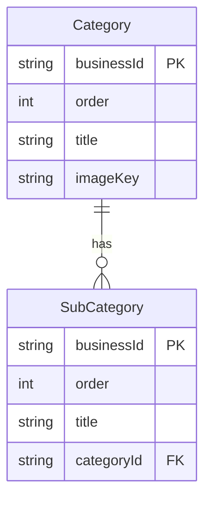

# Technical Report: Category and SubCategory API Analysis

## 1. API Inventory

### Category Endpoints

| HTTP Method | Route                   | Controller File                                                                     | Service File                                                                            | Protected | Auth Role   |
| ----------- | ----------------------- | ----------------------------------------------------------------------------------- | --------------------------------------------------------------------------------------- | --------- | ----------- |
| GET         | `/categories`           | [`categories.route.ts:19`](backend/src/modules/categories/categories.route.ts:19)   | [`categories.service.ts:16`](backend/src/modules/categories/categories.service.ts:16)   | ❌        | Public      |
| GET         | `/categories/:id`       | [`categories.route.ts:24`](backend/src/modules/categories/categories.route.ts:24)   | [`categories.service.ts:24`](backend/src/modules/categories/categories.service.ts:24)   | ❌        | Public      |
| POST        | `/categories`           | [`categories.route.ts:38`](backend/src/modules/categories/categories.route.ts:38)   | [`categories.service.ts:30`](backend/src/modules/categories/categories.service.ts:30)   | ✅        | SUPER_ADMIN |
| PUT         | `/categories/:id`       | [`categories.route.ts:55`](backend/src/modules/categories/categories.route.ts:55)   | [`categories.service.ts:40`](backend/src/modules/categories/categories.service.ts:40)   | ✅        | SUPER_ADMIN |
| DELETE      | `/categories/:id`       | [`categories.route.ts:72`](backend/src/modules/categories/categories.route.ts:72)   | [`categories.service.ts:53`](backend/src/modules/categories/categories.service.ts:53)   | ✅        | SUPER_ADMIN |
| PUT         | `/categories/:id/image` | [`categories.route.ts:84`](backend/src/modules/categories/categories.route.ts:84)   | [`categories.service.ts:132`](backend/src/modules/categories/categories.service.ts:132) | ✅        | SUPER_ADMIN |
| DELETE      | `/categories/:id/image` | [`categories.route.ts:108`](backend/src/modules/categories/categories.route.ts:108) | [`categories.service.ts:81`](backend/src/modules/categories/categories.service.ts:81)   | ✅        | SUPER_ADMIN |
| PUT         | `/categories/reorder`   | [`categories.route.ts:120`](backend/src/modules/categories/categories.route.ts:120) | [`categories.service.ts:92`](backend/src/modules/categories/categories.service.ts:92)   | ✅        | SUPER_ADMIN |

### SubCategory Endpoints

| HTTP Method | Route                                 | Controller File                                                                            | Service File                                                                                   | Protected | Auth Role   |
| ----------- | ------------------------------------- | ------------------------------------------------------------------------------------------ | ---------------------------------------------------------------------------------------------- | --------- | ----------- |
| GET         | `/sub-categories/:id`                 | [`subCategories.route.ts:17`](backend/src/modules/subCategories/subCategories.route.ts:17) | [`subCategories.service.ts:18`](backend/src/modules/subCategories/subCategories.service.ts:18) | ✅        | SUPER_ADMIN |
| GET         | `/sub-categories/:id/products`        | [`subCategories.route.ts:96`](backend/src/modules/subCategories/subCategories.route.ts:96) | [`subCategories.service.ts:14`](backend/src/modules/subCategories/subCategories.service.ts:14) | ❌        | Public      |
| GET         | `/categories/:id/subcategories`       | [`categories.route.ts:29`](backend/src/modules/categories/categories.route.ts:29)          | [`subCategories.service.ts:10`](backend/src/modules/subCategories/subCategories.service.ts:10) | ❌        | Public      |
| POST        | `/sub-categories`                     | [`subCategories.route.ts:28`](backend/src/modules/subCategories/subCategories.route.ts:28) | [`subCategories.service.ts:24`](backend/src/modules/subCategories/subCategories.service.ts:24) | ✅        | SUPER_ADMIN |
| PUT         | `/sub-categories/:id`                 | [`subCategories.route.ts:45`](backend/src/modules/subCategories/subCategories.route.ts:45) | [`subCategories.service.ts:39`](backend/src/modules/subCategories/subCategories.service.ts:39) | ✅        | SUPER_ADMIN |
| DELETE      | `/sub-categories/:id`                 | [`subCategories.route.ts:62`](backend/src/modules/subCategories/subCategories.route.ts:62) | [`subCategories.service.ts:67`](backend/src/modules/subCategories/subCategories.service.ts:67) | ✅        | SUPER_ADMIN |
| PUT         | `/sub-categories/reorder/:categoryId` | [`subCategories.route.ts:73`](backend/src/modules/subCategories/subCategories.route.ts:73) | [`subCategories.service.ts:86`](backend/src/modules/subCategories/subCategories.service.ts:86) | ✅        | SUPER_ADMIN |

---

## 2. CRUD Breakdown

### Category Operations

#### **CREATE Category**

- **Route**: `POST /categories`
- **Input DTO**: [`CreateCategorySchema`](backend/src/modules/categories/categories.schema.ts:21)
  ```typescript
  {
    title?: string; // Optional, defaults to "New Category"
    imageKey?: string;
    imagePath?: File; // Not used in service
  }
  ```
- **Validation**: Zod schema allows empty title (min: 0)
- **Prisma Query**: [`categories.repository.ts:38-44`](backend/src/modules/categories/categories.repository.ts:38)
  ```typescript
  prisma.category.create({
  	data: {
  		title: data.title ?? "New Category",
  		imageKey: data.imageKey,
  	},
  });
  ```
- **Relations Touched**: None (standalone creation)
- **Returned**: Created category object

#### **READ Category (All)**

- **Route**: `GET /categories`
- **Prisma Query**: [`categories.repository.ts:9-25`](backend/src/modules/categories/categories.repository.ts:9)
  ```typescript
  prisma.category.findMany({
  	orderBy: { order: "asc" },
  	include: {
  		subCategories: {
  			orderBy: { order: "asc" },
  			include: { _count: { select: { products: true } } },
  		},
  		_count: { select: { subCategories: true } },
  	},
  });
  ```
- **Response Enhancement**: Adds `imageUrl` via S3 storage service
- **Relations**: Returns nested `subCategories` with product counts

#### **READ Category (By ID)**

- **Route**: `GET /categories/:id`
- **Prisma Query**: [`categories.repository.ts:28-31`](backend/src/modules/categories/categories.repository.ts:28)
  ```typescript
  prisma.category.findUnique({
  	where: { businessId },
  });
  ```
- **Relations**: None (flat category object)

#### **UPDATE Category**

- **Route**: `PUT /categories/:id`
- **Input DTO**: [`UpdateCategorySchema`](backend/src/modules/categories/categories.schema.ts:27)
  ```typescript
  {
    title?: string;
    imageKey?: string;
  }
  ```
- **Prisma Query**: [`categories.repository.ts:47-56`](backend/src/modules/categories/categories.repository.ts:47)
  ```typescript
  prisma.category.update({
  	where: { businessId },
  	data: updateData,
  });
  ```
- **Relations Touched**: None

#### **DELETE Category**

- **Route**: `DELETE /categories/:id`
- **Pre-delete Check**: [`categories.service.ts:57-64`](backend/src/modules/categories/categories.service.ts:57)
  - Counts subcategories via [`categories.repository.ts:89-92`](backend/src/modules/categories/categories.repository.ts:89)
  - Throws `ValidationError` if subcategories exist
- **Image Cleanup**: Deletes S3 object if exists
- **Prisma Query**: [`categories.repository.ts:59-62`](backend/src/modules/categories/categories.repository.ts:59)
  ```typescript
  prisma.category.delete({
  	where: { businessId },
  });
  ```
- **Relations**: Fails if `SubCategory` records exist (no cascade)

---

### SubCategory Operations

#### **CREATE SubCategory**

- **Route**: `POST /sub-categories`
- **Input DTO**: [`CreateSubCategorySchema`](backend/src/modules/subCategories/subCategories.schema.ts:4)
  ```typescript
  {
    title?: string;
    categoryId: string; // Required
  }
  ```
- **Validation**: Category existence check via [`subCategories.repository.ts:59-62`](backend/src/modules/subCategories/subCategories.repository.ts:59)
- **Prisma Query**: [`subCategories.repository.ts:28-34`](backend/src/modules/subCategories/subCategories.repository.ts:28)
  ```typescript
  prisma.subCategory.create({
  	data: {
  		title: data.title ?? "New SubCategory",
  		categoryId: data.categoryId,
  	},
  });
  ```
- **Relations Touched**: Creates FK to `Category`

#### **READ SubCategory (All by Category)**

- **Route**: `GET /categories/:id/subcategories`
- **Prisma Query**: [`subCategories.repository.ts:9-13`](backend/src/modules/subCategories/subCategories.repository.ts:9)
  ```typescript
  prisma.subCategory.findMany({
  	where: { categoryId },
  	orderBy: { order: "asc" },
  });
  ```

#### **READ SubCategory (By ID)**

- **Route**: `GET /sub-categories/:id`
- **Prisma Query**: [`subCategories.repository.ts:16-19`](backend/src/modules/subCategories/subCategories.repository.ts:16)
  ```typescript
  prisma.subCategory.findUnique({
  	where: { businessId },
  });
  ```
- **Protected**: Requires SUPER_ADMIN (unlike public category reads)

#### **UPDATE SubCategory**

- **Route**: `PUT /sub-categories/:id`
- **Input DTO**: [`UpdateSubCategorySchema`](backend/src/modules/subCategories/subCategories.schema.ts:10)
  ```typescript
  {
    title?: string;
    categoryId?: string; // Allows reassignment to different category
  }
  ```
- **Logic**: [`subCategories.service.ts:39-64`](backend/src/modules/subCategories/subCategories.service.ts:39)
  - Validates new category exists if `categoryId` changes
  - Updates FK reference if reassigned
- **Prisma Query**: [`subCategories.repository.ts:37-49`](backend/src/modules/subCategories/subCategories.repository.ts:37)

#### **DELETE SubCategory**

- **Route**: `DELETE /sub-categories/:id`
- **Pre-delete Check**: [`subCategories.service.ts:69-74`](backend/src/modules/subCategories/subCategories.service.ts:69)
  - Counts products via [`subCategories.repository.ts:66-69`](backend/src/modules/subCategories/subCategories.repository.ts:66)
  - Throws error if products exist
- **Prisma Query**: [`subCategories.repository.ts:52-55`](backend/src/modules/subCategories/subCategories.repository.ts:52)

---

## 3. Ordering Semantics

### Current Implementation Analysis

The `order Int @default(autoincrement())` field in both models uses database-level auto-increment, but the actual ordering semantics are **broken/accidental**:

| Scenario               | Current Behavior                                                                                  |
| ---------------------- | ------------------------------------------------------------------------------------------------- |
| **Initial Insert**     | Gets next auto-increment value (1, 2, 3...)                                                       |
| **Middle Insert**      | Gets NEW auto-increment value (NOT middle position)                                               |
| **Reorder Endpoint**   | **Explicit override** via `PUT /categories/reorder` and `PUT /sub-categories/reorder/:categoryId` |
| **Delete Category**    | Order values of OTHER categories remain unchanged (gaps created)                                  |
| **Delete SubCategory** | Order values of OTHER subcategories remain unchanged (gaps created)                               |

### Specific Issues

1. **No Automatic Gap Filling**: Deleting a category/subcategory leaves gaps in the `order` sequence
2. **Insert at Position Not Supported**: There's no logic to insert at a specific order position - new items always get auto-incremented value
3. **Reorder Requires Complete List**: The `/reorder` endpoints expect ALL items with their desired order values
4. **Order Conflicts Possible**: The reorder endpoints validate that the provided items match existing IDs, but don't validate that order values form a contiguous sequence

### Reorder Implementation Details

**Categories**: [`categories.repository.ts:122-138`](backend/src/modules/categories/categories.repository.ts:122)

```typescript
prisma.$transaction(async (tx) => {
	const updatePromises = items.map((item) =>
		tx.category.update({
			where: { businessId: item.businessId },
			data: { order: item.order },
		}),
	);
	await Promise.all(updatePromises);
});
```

**SubCategories**: [`subCategories.repository.ts:99-116`](backend/src/modules/subCategories/subCategories.repository.ts:99)

- Same pattern, scoped to `categoryId`

---

## 4. Relationship Integrity

### SubCategory → Category Integrity Enforcement

| Scenario                                       | Behavior                                                                                                                                                      |
| ---------------------------------------------- | ------------------------------------------------------------------------------------------------------------------------------------------------------------- |
| **Create SubCategory with invalid categoryId** | Explicitly checked in service [`subCategories.service.ts:26-29`](backend/src/modules/subCategories/subCategories.service.ts:26) - throws `CATEGORY_NOT_FOUND` |
| **Delete Category with SubCategories**         | Explicitly checked [`categories.service.ts:57-64`](backend/src/modules/categories/categories.service.ts:57) - throws `ValidationError`                        |
| **Delete Category (no SubCategories)**         | Proceeds to delete - no cascade defined in Prisma                                                                                                             |
| **Reassign SubCategory to another Category**   | Explicitly supported via `categoryId` in update [`subCategories.service.ts:43-55`](backend/src/modules/subCategories/subCategories.service.ts:43)             |

### Prisma Relationship (Authoritative Schema)

From [`schema.prisma:85-96`](backend/prisma/schema.prisma:85):

```prisma
model SubCategory {
  category   Category  @relation(fields: [categoryId], references: [businessId])
  categoryId String
  @@index([categoryId])
}
```

**Observations**:

- No `@onDelete` cascade specified in schema
- Database-level referential integrity depends on how migrations were run
- FK constraint likely exists but without cascade behavior
- Application-level checks provide the actual protection

---

## 5. Authorization & Roles

### Authorization Guards

**Auth Guard**: [`auth.guard.ts`](backend/src/infrastructure/auth/auth.guard.ts)

- Validates Bearer token from `Authorization` header
- Verifies JWT access token
- Attaches `{ id, role }` to `ctx.user`

**Role Guard**: [`role.guard.ts`](backend/src/infrastructure/auth/role.guard.ts)

```typescript
requireRole("SUPER_ADMIN" | "USER");
// Checks ctx.user.role === requiredRole
// Returns 403 Forbidden if mismatch
```

### Authorization Matrix

| Endpoint                                  | Auth Required | Role Required | Actual Implementation                                        |
| ----------------------------------------- | ------------- | ------------- | ------------------------------------------------------------ |
| `GET /categories`                         | ❌            | -             | ✅ Public (no guard)                                         |
| `GET /categories/:id`                     | ❌            | -             | ✅ Public (no guard)                                         |
| `GET /categories/:id/subcategories`       | ❌            | -             | ✅ Public (no guard)                                         |
| `GET /sub-categories/:id/products`        | ❌            | -             | ✅ Public (no guard)                                         |
| `POST /categories`                        | ✅            | SUPER_ADMIN   | ✅ `beforeHandle: [requireAuth, requireRole("SUPER_ADMIN")]` |
| `PUT /categories/:id`                     | ✅            | SUPER_ADMIN   | ✅ Same guard                                                |
| `DELETE /categories/:id`                  | ✅            | SUPER_ADMIN   | ✅ Same guard                                                |
| `PUT /categories/:id/image`               | ✅            | SUPER_ADMIN   | ✅ Same guard                                                |
| `DELETE /categories/:id/image`            | ✅            | SUPER_ADMIN   | ✅ Same guard                                                |
| `PUT /categories/reorder`                 | ✅            | SUPER_ADMIN   | ✅ Same guard                                                |
| `GET /sub-categories/:id`                 | ✅            | SUPER_ADMIN   | ⚠️ Guard present but route seems public in intent            |
| `POST /sub-categories`                    | ✅            | SUPER_ADMIN   | ✅ `beforeHandle: [requireAuth, requireRole("SUPER_ADMIN")]` |
| `PUT /sub-categories/:id`                 | ✅            | SUPER_ADMIN   | ✅ Same guard                                                |
| `DELETE /sub-categories/:id`              | ✅            | SUPER_ADMIN   | ✅ Same guard                                                |
| `PUT /sub-categories/reorder/:categoryId` | ✅            | SUPER_ADMIN   | ✅ Same guard                                                |

### Inconsistency Note

The `GET /sub-categories/:id` endpoint has `SUPER_ADMIN` protection but `GET /categories/:id` does not. This is inconsistent - single subcategory fetch should arguably be public if subcategories are listed publicly.

---

## 6. Known or Likely Issues

### Critical Issues

| Issue                               | Location      | Impact                                                          |
| ----------------------------------- | ------------- | --------------------------------------------------------------- |
| **Order field uses auto-increment** | Prisma schema | Inserted items get new order values, not insert-at-position     |
| **No cascade delete**               | Prisma schema | Orphaned SubCategories possible if Category deleted outside app |
| **No order gap management**         | Service layer | Deleted items leave gaps, causing non-contiguous ordering       |

### Medium Issues

| Issue                                            | Location                                                                                          | Impact                                                                          |
| ------------------------------------------------ | ------------------------------------------------------------------------------------------------- | ------------------------------------------------------------------------------- |
| **Reorder doesn't validate order sequence**      | [`categories.service.ts:92-113`](backend/src/modules/categories/categories.service.ts:92)         | Frontend could send non-sequential order values                                 |
| **Image upload overwrites without version**      | [`categories.service.ts:132-159`](backend/src/modules/categories/categories.service.ts:132)       | Previous image deleted before new one uploaded - potential data loss on failure |
| **SubCategory reassignment to any Category**     | [`subCategories.service.ts:43-55`](backend/src/modules/subCategories/subCategories.service.ts:43) | No business logic preventing cross-parent movement                              |
| **Public GET for subcategories by ID protected** | [`subCategories.route.ts:17-25`](backend/src/modules/subCategories/subCategories.route.ts:17)     | Inconsistent with public subcategory product listing                            |

### Frontend Confusion Risks

1. **Reorder API Expects Complete List**: Frontend must track ALL items and their desired positions - partial updates not supported
2. **Auto-increment creates unpredictable order**: Users adding categories won't get the order they expect
3. **Image URLs are derived from S3 keys**: Frontend must use `imageUrl` field (computed) not `imageKey`
4. **No "move to position" endpoint**: Frontend must implement full reorder logic client-side

---

## Summary Diagram



**Key Takeaways**:

- Order is **application-managed** via explicit reorder endpoints
- Deletion checks prevent orphans at application level
- No cascading deletes - explicit FK constraints
- SUPER_ADMIN only for all write operations
- Public read access for categories and subcategory products
