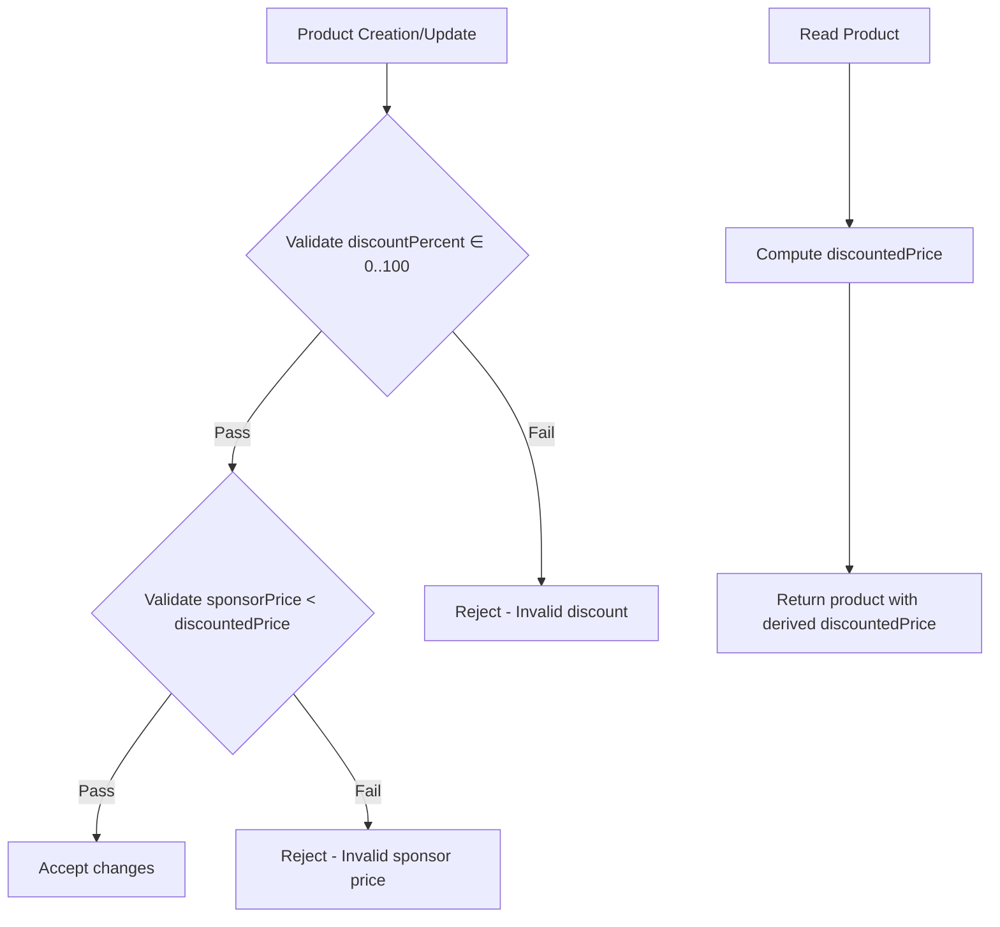

# Prisma Schema Refactor Plan

## Document Information

| Property | Value          |
| -------- | -------------- |
| Version  | 1.0            |
| Created  | 2026-02-09     |
| Status   | Draft          |
| Author   | Architect Mode |

---

## 1. Executive Summary

This document outlines a comprehensive refactoring plan for the Madar Market e-commerce platform's Prisma schema. The refactor addresses three primary issues:

1. **Mixed ID Strategies**: Current schema uses `Int autoincrement` for some tables and `CUID` for others, creating inconsistency and potential migration complexity
2. **Unused Order Columns**: Several tables contain `order` columns that are never used and should be removed
3. **Unspecified Attributes Model**: The current `Attributes` model is per-product but should be refactored to support global/reusable attribute definitions

### Key Architectural Decisions (Locked)

| Category               | ID Strategy                                                                         | Reasoning                                                                                                |
| ---------------------- | ----------------------------------------------------------------------------------- | -------------------------------------------------------------------------------------------------------- |
| Internal/System Tables | `Int @id @default(autoincrement())`                                                 | User, OTP, RefreshToken, RevokedAccessToken - simple, sequential, low-traffic                            |
| Domain/Business Tables | `id Int @id @default(autoincrement())` + `publicId String @unique @default(cuid())` | Category, SubCategory, Product, ProductImage - DB uses id for relations, APIs expose publicId externally |
| Order Columns          | Remove all                                                                          | Use `createdAt` for sorting instead                                                                      |
| Attributes             | `AttributeDefinition` + `ProductAttribute`                                          | Global/reusable attribute definitions with product-specific values                                       |

## 1.1 ID Terminology Reference

| Term       | Definition                                      | Usage                                            |
| ---------- | ----------------------------------------------- | ------------------------------------------------ |
| `id`       | Primary Key (PK) - internal, numeric identifier | Database joins, foreign keys, internal app logic |
| `publicId` | Public Identifier - external-facing CUID        | API endpoints, URL routing, external consumers   |

**Important Rules:**

- **Never** accept `id` in API requests - use `publicId` instead
- **Never** use `publicId` in foreign key relations - use `id` instead
- **Always** return `publicId` in API responses

- Unified ID strategy across domain tables with internal numeric ID + public-facing CUID
- Cleaner schema with removal of unused order columns
- Scalable attribute system supporting reusable definitions
- Improved API security by not exposing internal numeric IDs

---

## 2. Current State Analysis

### 2.1 Current Models Overview

| Model              | Current ID Type             | Has Order Column | Issues                                                        |
| ------------------ | --------------------------- | ---------------- | ------------------------------------------------------------- |
| User               | Int @id @autoincrement()    | No               | ✅ Correct (system table)                                     |
| OTP                | Int @id @autoincrement()    | No               | ✅ Correct (system table)                                     |
| RefreshToken       | Int @id @autoincrement()    | No               | ✅ Correct (system table)                                     |
| RevokedAccessToken | Int @id @autoincrement()    | No               | ✅ Correct (system table)                                     |
| Category           | String @id @default(cuid()) | Yes (order)      | ❌ Missing internal Int ID                                    |
| SubCategory        | String @id @default(cuid()) | Yes (order)      | ❌ Missing internal Int ID                                    |
| Product            | String @id @default(cuid()) | Yes (order)      | ❌ Missing internal Int ID                                    |
| Attributes         | String @id @default(cuid()) | Yes (order)      | ❌ To be replaced with AttributeDefinition + ProductAttribute |
| ProductImage       | String @id @default(cuid()) | Yes (order)      | ❌ Missing internal Int ID                                    |

### 2.2 Current Schema Issues Detail

#### Issue 1: Mixed ID Strategies

**Current State:**

- System tables: `User`, `OTP`, `RefreshToken`, `RevokedAccessToken` use `Int @id @default(autoincrement())`
- Business tables: `Category`, `SubCategory`, `Product`, `Attributes`, `ProductImage` use `String @id @default(cuid())`

**Problem:**

- Inconsistent approach makes code harder to maintain
- Business tables expose internal IDs via CUID which may reveal entity count
- Numeric autoincrement is more performant for joins and indexes
- **Key Point**: `id` is the Primary Key (PK) for database relations, `publicId` is the Public Identifier for external APIs
- **API Design Rule**: APIs should NEVER accept `id` externally, DB relations should NEVER use `publicId`

**Solution:**

- Add internal `Int @id @default(autoincrement())` to all business tables
- Add `publicId String @unique @default(cuid())` for external-facing identifiers
- Keep system tables as-is (no publicId needed)

#### Issue 2: Unused Order Columns

**Current State:**

- `Category.order Int @default(autoincrement())`
- `SubCategory.order Int @default(autoincrement())`
- `Product.order Int @default(autoincrement())`
- `Attributes.order Int @default(autoincrement())`
- `ProductImage.order Int @default(autoincrement())`

**Problem:**

- These columns are never queried or used
- Waste of storage and index space
- Add complexity without value

**Solution:**

- Remove all `order` columns
- Use `createdAt` for sorting when needed

#### Issue 3: Attributes Model Misalignment

**Current State:**

```prisma
model Attributes {
  businessId  String  @id @default(cuid())
  order       Int     @default(autoincrement())
  title       String?
  description String?

  product   Product @relation(fields: [productId], references: [businessId])
  productId String

  @@index([productId])
}
```

**Problem:**

- Attributes are per-product, not reusable
- No way to define attribute types or validation rules
- Cannot reuse attribute definitions across products

**Solution:**

```prisma
model AttributeDefinition {
  id          Int     @id @default(autoincrement())
  publicId    String  @unique @default(cuid())
  name        String
  type        AttributeType
  unit        String? // e.g., "kg", "ml", "pieces"
  isRequired  Boolean @default(false)
  options     String[] // For ENUM type attributes

  productAttributes ProductAttribute[]
}

model ProductAttribute {
  id                  Int     @id @default(autoincrement())
  publicId            String  @unique @default(cuid())
  productId           Int     // References Product.id (internal)
  attributeDefinitionId Int   // References AttributeDefinition.id

  value               String

  product             Product @relation(fields: [productId], references: [id])
  attributeDefinition AttributeDefinition @relation(fields: [attributeDefinitionId], references: [id])

  @@index([productId])
  @@index([attributeDefinitionId])
}
```

---

## 3. Models to Change/Add/Remove

### 3.1 Models to Modify

| Model        | Changes                                                                                                                                                          | Risk Level |
| ------------ | ---------------------------------------------------------------------------------------------------------------------------------------------------------------- | ---------- |
| Category     | Add `id Int @id @default(autoincrement())`, Add `publicId String @unique @default(cuid())`, Remove `order`                                                       | Medium     |
| SubCategory  | Add `id Int @id @default(autoincrement())`, Add `publicId String @unique @default(cuid())`, Remove `order`, Change `categoryId` to reference `category.id`       | High       |
| Product      | Add `id Int @id @default(autoincrement())`, Add `publicId String @unique @default(cuid())`, Remove `order`, Change `subCategoryId` to reference `subCategory.id` | High       |
| ProductImage | Add `id Int @id @default(autoincrement())`, Add `publicId String @unique @default(cuid())`, Remove `order`, Change `productId` to reference `product.id`         | Medium     |
| Attributes   | **Remove entire model** - replace with AttributeDefinition + ProductAttribute                                                                                    | High       |

### 3.2 Models to Add

| Model               | Fields                                                | Purpose                           |
| ------------------- | ----------------------------------------------------- | --------------------------------- |
| AttributeDefinition | id, publicId, name, type, unit, isRequired, options   | Global attribute definitions      |
| ProductAttribute    | id, publicId, productId, attributeDefinitionId, value | Product-specific attribute values |

### 3.3 Models to Remove

| Model      | Reason                                             |
| ---------- | -------------------------------------------------- |
| Attributes | Replaced by AttributeDefinition + ProductAttribute |

### 3.4 Models No Change Required

| Model              | Reason                           |
| ------------------ | -------------------------------- |
| User               | Already uses correct ID strategy |
| OTP                | Already uses correct ID strategy |
| RefreshToken       | Already uses correct ID strategy |
| RevokedAccessToken | Already uses correct ID strategy |

---

## 4. Proposed Schema After Refactor

```prisma
// System Tables - No Changes
model User {
  id           Int      @id @default(autoincrement())
  phoneNumber  String   @unique
  passwordHash String
  createdAt    DateTime @default(now())
  updatedAt    DateTime @updatedAt

  otps          OTP[]
  refreshTokens RefreshToken[]

  role                Role                 @default(USER)
  revokedAccessTokens RevokedAccessToken[]
}

model OTP {
  id          Int      @id @default(autoincrement())
  phoneNumber String
  codeHash    String
  expiresAt   DateTime
  consumed    Boolean  @default(false)

  user   User? @relation(fields: [userId], references: [id])
  userId Int?

  createdAt DateTime @default(now())
}

model RefreshToken {
  id        Int      @id @default(autoincrement())
  tokenHash String
  revoked   Boolean  @default(false)
  expiresAt DateTime

  user   User @relation(fields: [userId], references: [id])
  userId Int

  createdAt DateTime @default(now())
}

model RevokedAccessToken {
  id        Int      @id @default(autoincrement())
  tokenHash String   @unique
  expiresAt DateTime

  user   User @relation(fields: [userId], references: [id])
  userId Int

  createdAt DateTime @default(now())

  @@index([tokenHash])
  @@index([userId])
}

enum Role {
  USER
  SUB_ADMIN
  SUPER_ADMIN
}

// Domain Tables - Refactored
model Category {
  id        Int        @id @default(autoincrement())
  publicId  String     @unique @default(cuid())
  title     String
  imageKey  String? // S3 object key, e.g. categories/id/filename.webp

  subCategories SubCategory[]

  createdAt DateTime @default(now())
  updatedAt DateTime @updatedAt

  @@index([publicId])
}

model SubCategory {
  id        Int       @id @default(autoincrement())
  publicId   String    @unique @default(cuid())
  title     String
  category   Category  @relation(fields: [categoryId], references: [id])
  categoryId Int

  products  Product[]

  createdAt DateTime @default(now())
  updatedAt DateTime @updatedAt

  @@index([publicId])
  @@index([categoryId])
}

model Product {
  id              Int           @id @default(autoincrement())
  publicId        String        @unique @default(cuid())
  title           String
  description     String?
  price           Decimal       @db.Decimal(12, 2)
  discountPercent Int           @default(0) // 0..100
  sponsorPrice    Decimal?      @db.Decimal(12, 2)

  subCategory     SubCategory   @relation(fields: [subCategoryId], references: [id])
  subCategoryId   Int

  attributes      ProductAttribute[]
  images          ProductImage[]

  createdAt       DateTime      @default(now())
  updatedAt       DateTime      @updatedAt

  @@index([publicId])
  @@index([subCategoryId])
}

// Pricing invariants enforced at database level via CHECK constraints
// These are added via raw SQL in migration, not directly in Prisma schema
// See Section 4.X Pricing Invariants for details

model ProductImage {
  id        Int     @id @default(autoincrement())
  publicId  String  @unique @default(cuid())

  product   Product @relation(fields: [productId], references: [id])
  productId Int

  key       String? // S3 object key, e.g. products/productId/filename.webp
  createdAt DateTime @default(now())

  @@index([publicId])
  @@index([productId])
}

// New Attribute System
enum AttributeType {
  TEXT
  NUMBER
  BOOLEAN
  ENUM
  DATE
}

model AttributeDefinition {
  id          Int     @id @default(autoincrement())
  publicId    String  @unique @default(cuid())
  name        String
  type        AttributeType
  unit        String? // e.g., "kg", "ml", "pieces"
  isRequired  Boolean @default(false)
  options     String[] @default([]) // Only meaningful when type = ENUM

  productAttributes ProductAttribute[]

  createdAt DateTime @default(now())
  updatedAt DateTime @updatedAt

  @@unique([name])
  @@index([publicId])
}

model ProductAttribute {
  id                  Int     @id @default(autoincrement())
  publicId            String  @unique @default(cuid())

  productId           Int     // References Product.id (internal)
  attributeDefinitionId Int   // References AttributeDefinition.id

  value               String

  product             Product @relation(fields: [productId], references: [id])
  attributeDefinition AttributeDefinition @relation(fields: [attributeDefinitionId], references: [id])

  createdAt DateTime @default(now())

  @@unique([productId, attributeDefinitionId])
  @@index([publicId])
  @@index([productId])
  @@index([attributeDefinitionId])
}
```

## 4.X Pricing Invariants

The Product model includes pricing fields that require special validation at the database level. Since Prisma doesn't natively support CHECK constraints, these are enforced via raw SQL in migrations.

### 4.X.1 discountPercent Constraint

| Property        | Value                            |
| --------------- | -------------------------------- |
| Range           | [0, 100]                         |
| Constraint Name | `product_discount_percent_range` |
| Enforcement     | PostgreSQL CHECK constraint      |

```sql
ALTER TABLE "Product"
ADD CONSTRAINT product_discount_percent_range
CHECK ("discountPercent" BETWEEN 0 AND 100);
```

### 4.X.2 sponsorPrice Constraint

| Property        | Value                                                      |
| --------------- | ---------------------------------------------------------- |
| Rule            | `sponsorPrice < discountedPrice` OR `sponsorPrice IS NULL` |
| Constraint Name | `product_sponsor_price_valid`                              |
| Enforcement     | PostgreSQL CHECK constraint                                |

```sql
ALTER TABLE "Product"
ADD CONSTRAINT product_sponsor_price_valid
CHECK (
  "sponsorPrice" IS NULL
  OR "sponsorPrice" <
     ("price" * (1 - ("discountPercent"::decimal / 100)))
);
```

### 4.X.3 discountedPrice Derivation

**Important:** `discountedPrice` is a DERIVED value and is NEVER stored in the database.

**Application Logic:**

```typescript
// Compute discounted price on-the-fly
function getDiscountedPrice(product: Product): number {
	return Number(product.price) * (1 - product.discountPercent / 100);
}

// Check if sponsor price is valid
function isSponsorPriceValid(product: Product): boolean {
	if (!product.sponsorPrice) return true;
	const discountedPrice = getDiscountedPrice(product);
	return Number(product.sponsorPrice) < discountedPrice;
}
```

### 4.X.4 Pricing Flow



---

## 5. Migration Strategy

### 5.1 Migration Order (Step-by-Step)

**Phase 1: Preparation (Safe to Do Now)**

1. Create new models without removing old ones
2. Add new columns to existing tables (id, publicId) as nullable
3. Create AttributeDefinition and ProductAttribute models
4. Set up foreign key constraints as NOT YET ENFORCED

**Phase 2: Data Migration**

1. Backfill `id` column for Category, SubCategory, Product, ProductImage
2. Backfill `publicId` column using CUID for all business tables
3. Migrate data from Attributes to AttributeDefinition + ProductAttribute
4. Create foreign key references for categoryId, subCategoryId, productId

**Phase 3: Application Updates**

1. Update API routes to use new column names
2. Update repository layer to use internal IDs for joins
3. Update DTOs/response schemas to expose publicId
4. Update frontend to use publicId for display/routing

**Phase 4: Constraint Enforcement**

1. Add foreign key constraints with cascade delete
2. Add unique constraints for publicId
3. Remove old columns (order, old foreign keys)
4. Remove old Attributes table

### 5.2 Data Backfill Procedures

#### 5.2.1 Backfill Category Table

```sql
-- Add new columns as nullable
ALTER TABLE "Category" ADD COLUMN "id" SERIAL;
ALTER TABLE "Category" ADD COLUMN "publicId" TEXT UNIQUE;

-- Backfill publicId for existing records
UPDATE "Category" SET "publicId" = "businessId";

-- Make columns NOT NULL
ALTER TABLE "Category" ALTER COLUMN "id" SET NOT NULL;
ALTER TABLE "Category" ALTER COLUMN "publicId" SET NOT NULL;
```

#### 5.2.2 Backfill SubCategory Table

```sql
-- Add new columns
ALTER TABLE "SubCategory" ADD COLUMN "id" SERIAL;
ALTER TABLE "SubCategory" ADD COLUMN "publicId" TEXT UNIQUE;

-- Update foreign key to reference Category.id
ALTER TABLE "SubCategory" ADD COLUMN "new_categoryId" INTEGER;
UPDATE "SubCategory" s
SET "new_categoryId" = c.id
FROM "Category" c
WHERE s."categoryId" = c."publicId";

-- Drop old FK, rename new column
ALTER TABLE "SubCategory" DROP CONSTRAINT "SubCategory_categoryId_fkey";
ALTER TABLE "SubCategory" ALTER COLUMN "categoryId" TYPE INTEGER USING "new_categoryId";
ALTER TABLE "SubCategory" DROP COLUMN "new_categoryId";

-- Add proper FK constraint
ALTER TABLE "SubCategory" ADD CONSTRAINT "SubCategory_categoryId_fkey"
FOREIGN KEY ("categoryId") REFERENCES "Category"("id") ON DELETE CASCADE;

-- Backfill publicId
UPDATE "SubCategory" SET "publicId" = "businessId";

-- Make columns NOT NULL
ALTER TABLE "SubCategory" ALTER COLUMN "id" SET NOT NULL;
ALTER TABLE "SubCategory" ALTER COLUMN "publicId" SET NOT NULL;
```

#### 5.2.3 Backfill Product Table

```sql
-- Add new columns
ALTER TABLE "Product" ADD COLUMN "id" SERIAL;
ALTER TABLE "Product" ADD COLUMN "publicId" TEXT UNIQUE;

-- Update foreign key to reference SubCategory.id
ALTER TABLE "Product" ADD COLUMN "new_subCategoryId" INTEGER;
UPDATE "Product" p
SET "new_subCategoryId" = s.id
FROM "SubCategory" s
WHERE p."subCategoryId" = s."publicId";

-- Drop old FK, rename new column
ALTER TABLE "Product" DROP CONSTRAINT "Product_subCategoryId_fkey";
ALTER TABLE "Product" ALTER COLUMN "subCategoryId" TYPE INTEGER USING "new_subCategoryId";
ALTER TABLE "Product" DROP COLUMN "new_subCategoryId";

-- Add proper FK constraint
ALTER TABLE "Product" ADD CONSTRAINT "Product_subCategoryId_fkey"
FOREIGN KEY ("subCategoryId") REFERENCES "SubCategory"("id") ON DELETE CASCADE;

-- Backfill publicId
UPDATE "Product" SET "publicId" = "businessId";

-- Make columns NOT NULL
ALTER TABLE "Product" ALTER COLUMN "id" SET NOT NULL;
ALTER TABLE "Product" ALTER COLUMN "publicId" SET NOT NULL;

-- Add pricing constraints (PostgreSQL CHECK constraints)
ALTER TABLE "Product"
ADD CONSTRAINT product_discount_percent_range
CHECK ("discountPercent" BETWEEN 0 AND 100);

ALTER TABLE "Product"
ADD CONSTRAINT product_sponsor_price_valid
CHECK (
  "sponsorPrice" IS NULL
  OR "sponsorPrice" <
     ("price" * (1 - ("discountPercent"::decimal / 100)))
);
```

#### 5.2.4 Backfill ProductImage Table

```sql
-- Add new columns
ALTER TABLE "ProductImage" ADD COLUMN "id" SERIAL;
ALTER TABLE "ProductImage" ADD COLUMN "publicId" TEXT UNIQUE;

-- Update foreign key to reference Product.id
ALTER TABLE "ProductImage" ADD COLUMN "new_productId" INTEGER;
UPDATE "ProductImage" pi
SET "new_productId" = p.id
FROM "Product" p
WHERE pi."productId" = p."publicId";

-- Drop old FK, rename new column
ALTER TABLE "ProductImage" DROP CONSTRAINT "ProductImage_productId_fkey";
ALTER TABLE "ProductImage" ALTER COLUMN "productId" TYPE INTEGER USING "new_productId";
ALTER TABLE "ProductImage" DROP COLUMN "new_productId";

-- Add proper FK constraint
ALTER TABLE "ProductImage" ADD CONSTRAINT "ProductImage_productId_fkey"
FOREIGN KEY ("productId") REFERENCES "Product"("id") ON DELETE CASCADE;

-- Backfill publicId
UPDATE "ProductImage" SET "publicId" = "businessId";

-- Make columns NOT NULL
ALTER TABLE "ProductImage" ALTER COLUMN "id" SET NOT NULL;
ALTER TABLE "ProductImage" ALTER COLUMN "publicId" SET NOT NULL;
```

#### 5.2.5 Migrate Attributes to New Schema

```sql
-- Step 1: Deduplicate attributes by TRIM(LOWER(name)), generate new publicIds
INSERT INTO "AttributeDefinition" ("publicId", "name", "type", "isRequired")
SELECT DISTINCT ON (TRIM(LOWER(a."title")))
  gen_random_uuid()::text,
  TRIM(LOWER(a."title")),
  'TEXT'::"AttributeType",
  false
FROM "Attributes" a
WHERE a."title" IS NOT NULL
ORDER BY TRIM(LOWER(a."title")), a."businessId";

-- Step 2: Map product attributes to definitions using name matching
INSERT INTO "ProductAttribute" ("publicId", "productId", "attributeDefinitionId", "value")
SELECT
  gen_random_uuid()::text,
  p.id,
  ad.id,
  COALESCE(a."description", '')
FROM "Attributes" a
JOIN "Product" p ON p."publicId" = a."productId"
JOIN "AttributeDefinition" ad ON TRIM(LOWER(ad."name")) = TRIM(LOWER(a."title"));
```

### 5.3 Safety Checkpoints

| Checkpoint     | Validation                                | Rollback Action                 |
| -------------- | ----------------------------------------- | ------------------------------- |
| After Phase 1  | All new columns nullable, no data loss    | Drop new columns                |
| After Phase 2a | All records have valid id and publicId    | Re-run backfill or manual fix   |
| After Phase 2b | Foreign keys resolve correctly            | Reset and re-migrate data       |
| After Phase 3  | Application tests pass                    | Revert API changes              |
| After Phase 4  | Constraints enforced, no orphaned records | Disable constraints temporarily |

---

## 6. Index Changes Required

### 6.1 Indexes to Remove

| Table        | Index Name               | Reason                  |
| ------------ | ------------------------ | ----------------------- |
| Category     | (implicit on businessId) | Replacing with publicId |
| Category     | (order column)           | Removing order column   |
| SubCategory  | (implicit on businessId) | Replacing with publicId |
| SubCategory  | (order column)           | Removing order column   |
| Product      | (implicit on businessId) | Replacing with publicId |
| Product      | (order column)           | Removing order column   |
| ProductImage | (implicit on businessId) | Replacing with publicId |
| ProductImage | (order column)           | Removing order column   |
| Attributes   | (implicit on businessId) | Removing table          |
| Attributes   | (order column)           | Removing table          |

### 6.2 Indexes to Add

| Table               | Index Name                                   | Columns               | Purpose                          |
| ------------------- | -------------------------------------------- | --------------------- | -------------------------------- |
| Category            | `Category_publicId_idx`                      | publicId              | Unique constraint, fast lookups  |
| SubCategory         | `SubCategory_publicId_idx`                   | publicId              | Unique constraint, fast lookups  |
| SubCategory         | `SubCategory_categoryId_idx`                 | categoryId            | FK optimization                  |
| Product             | `Product_publicId_idx`                       | publicId              | Unique constraint, fast lookups  |
| Product             | `Product_subCategoryId_idx`                  | subCategoryId         | FK optimization                  |
| ProductImage        | `ProductImage_publicId_idx`                  | publicId              | Unique constraint, fast lookups  |
| ProductImage        | `ProductImage_productId_idx`                 | productId             | FK optimization                  |
| AttributeDefinition | `AttributeDefinition_publicId_idx`           | publicId              | Unique constraint                |
| ProductAttribute    | `ProductAttribute_publicId_idx`              | publicId              | Unique constraint                |
| ProductAttribute    | `ProductAttribute_productId_idx`             | productId             | FK optimization, product queries |
| ProductAttribute    | `ProductAttribute_attributeDefinitionId_idx` | attributeDefinitionId | FK optimization                  |

### 6.3 Indexes to Keep

| Table              | Index Name                         | Columns   | Reason             |
| ------------------ | ---------------------------------- | --------- | ------------------ |
| RevokedAccessToken | `RevokedAccessToken_tokenHash_idx` | tokenHash | Token validation   |
| RevokedAccessToken | `RevokedAccessToken_userId_idx`    | userId    | User token queries |

---

## 7. Application-Layer Changes

### 7.1 Repository Layer Changes

#### 7.1.1 Category Repository

**Current:**

```typescript
// backend/src/modules/categories/categories.repository.ts
async findAll() {
  return prisma.category.findMany({
    orderBy: { order: 'asc' }
  });
}

async findById(id: string) {
  return prisma.category.findUnique({
    where: { businessId: id }
  });
}
```

**After (CORRECTED - Public API only accepts publicId):**

```typescript
// Public API - only accepts publicId
async findByPublicId(publicId: string) {
  return prisma.category.findUnique({
    where: { publicId }
  });
}

// Internal/admin repository (separate file)
async findByIdInternal(id: number) {
  return prisma.category.findUnique({
    where: { id }
  });
}
```

**Important Rules:**

- **Never** create a dual-lookup `findById` that accepts both id and publicId
- Public APIs should **only** accept `publicId` in URL parameters
- Internal/admin use cases should use separate repositories or routes like `/internal/categories/:id`
- This prevents confusion and security issues from exposing internal IDs

#### 7.1.2 SubCategory Repository

**Changes:**

- Update `findById` to accept both id and publicId
- Update `findByCategoryId` to use internal category.id
- Add `findByPublicId` method

#### 7.1.3 Product Repository

**Changes:**

- Update `findById` to accept both id and publicId
- Update `findBySubCategoryId` to use internal subCategory.id
- Update `findByCategoryId` to join through SubCategory
- Add `findByPublicId` method
- Update attribute queries to use new ProductAttribute model

#### 7.1.4 ProductImage Repository

**Changes:**

- Update `findByProductId` to use internal product.id
- Update image upload to generate publicId

### 7.2 API Route Updates

#### 7.2.1 Category Routes

| Endpoint               | Current                     | After                         |
| ---------------------- | --------------------------- | ----------------------------- |
| GET /categories        | Returns all with businessId | Returns all with publicId, id |
| GET /categories/:id    | Finds by businessId         | Finds by id or publicId       |
| POST /categories       | Creates with businessId     | Returns new publicId          |
| PUT /categories/:id    | Updates by businessId       | Updates by id or publicId     |
| DELETE /categories/:id | Deletes by businessId       | Deletes by id or publicId     |

#### 7.2.2 SubCategory Routes

| Endpoint                                 | Current                      | After                                     |
| ---------------------------------------- | ---------------------------- | ----------------------------------------- |
| GET /sub-categories                      | Returns all with businessId  | Returns all with publicId, id             |
| GET /sub-categories/:id                  | Finds by businessId          | Finds by id or publicId                   |
| GET /sub-categories/category/:categoryId | Finds by category.businessId | Finds by category.id or category.publicId |
| POST /sub-categories                     | Creates with businessId      | Returns new publicId                      |
| PUT /sub-categories/:id                  | Updates by businessId        | Updates by id or publicId                 |

#### 7.2.3 Product Routes

| Endpoint                           | Current                        | After                              |
| ---------------------------------- | ------------------------------ | ---------------------------------- |
| GET /products                      | Returns all with businessId    | Returns all with publicId, id      |
| GET /products/:id                  | Finds by businessId            | Finds by id or publicId            |
| GET /products/category/:categoryId | Filters by category.businessId | Filters by category.id or publicId |
| POST /products                     | Creates with businessId        | Returns new publicId               |
| PUT /products/:id                  | Updates by businessId          | Updates by id or publicId          |
| DELETE /products/:id               | Deletes by businessId          | Deletes by id or publicId          |

#### 7.2.4 Product Image Routes

| Endpoint                         | Current                       | After                           |
| -------------------------------- | ----------------------------- | ------------------------------- |
| GET /products/:productId/images  | Lists by product.businessId   | Lists by product.id or publicId |
| POST /products/:productId/images | Creates image with businessId | Creates image with publicId     |

### 7.3 Frontend/API Consumer Updates

#### 7.3.1 TypeScript Type Updates

```typescript
// New types for frontend
interface Category {
	id: number;
	publicId: string;
	title: string;
	imageKey?: string;
	createdAt: Date;
	updatedAt: Date;
}

interface SubCategory {
	id: number;
	publicId: string;
	title: string;
	categoryId: number;
	createdAt: Date;
	updatedAt: Date;
}

interface Product {
	id: number;
	publicId: string;
	title: string;
	description?: string;
	price: number;
	discountPercent: number;
	sponsorPrice?: number;
	subCategoryId: number;
	createdAt: Date;
	updatedAt: Date;
}

interface ProductImage {
	id: number;
	publicId: string;
	productId: number;
	key?: string;
	createdAt: Date;
}
```

#### 7.3.2 API Client Updates

```typescript
// Update all API calls to use publicId for routing
// GET /api/categories/:publicId
// GET /api/products/:publicId

// Remove businessId from all response handling
// Update state management to use id for internal references
// Use publicId only for URL routing and external APIs
```

#### 7.3.3 URL Routing Updates

```typescript
// Before: /categories/:businessId
// After: /categories/:publicId

// Before: /products/:businessId/images
// After: /products/:publicId/images
```

---

## 8. Risk Assessment

### 8.1 Risk Summary Table

| Risk                            | Impact | Likelihood | Severity | Mitigation                                 |
| ------------------------------- | ------ | ---------- | -------- | ------------------------------------------ |
| Data loss during migration      | High   | Low        | Critical | Backup before migration, test on staging   |
| Foreign key constraint failures | High   | Medium     | Critical | Validate FKs before constraint enforcement |
| Application downtime            | Medium | Low        | High     | Implement blue-green deployment            |
| Broken external integrations    | Medium | Medium     | High     | Coordinate with API consumers              |
| Performance degradation         | Medium | Low        | Medium   | Monitor queries, add indexes gradually     |
| Rollback complexity             | Medium | Medium     | Medium   | Document rollback steps, test rollback     |

### 8.2 Detailed Risk Analysis

#### Risk 1: Data Loss During Migration

**Description:** Incorrect SQL during backfill could corrupt or lose data.

**Mitigation:**

- Take full database backup before migration
- Test migration on staging environment first
- Use transactions for each major step
- Validate row counts before and after each step

**Rollback:** Restore from backup or manually fix corrupted records

#### Risk 2: Foreign Key Constraint Failures

**Description:** Invalid foreign key references during migration could cause constraint violations.

**Mitigation:**

- Backfill foreign keys before adding constraints
- Validate all references exist before enabling FKs
- Use DEFERRABLE initially, then NOT DEFERRABLE after validation

**Rollback:** Disable constraints temporarily, fix data, re-validate

#### Risk 3: Application Downtime

**Description:** Migration may require brief downtime for schema changes.

**Mitigation:**

- Schedule migration during low-traffic period
- Use online schema change tools where possible
- Implement feature flags for gradual rollout
- Keep old columns until application is fully updated

**Rollback:** Revert schema changes, restore from backup if needed

#### Risk 4: Broken External Integrations

**Description:** Third-party services using old businessId will break.

**Mitigation:**

- Document API changes for all consumers
- Provide migration period with dual support
- Implement API versioning
- Send notifications before breaking changes

**Rollback:** Maintain old endpoints with deprecation warnings

#### Risk 5: Performance Degradation

**Description:** New schema or missing indexes could slow queries.

**Mitigation:**

- Add indexes before removing old ones
- Monitor query performance continuously
- Use EXPLAIN ANALYZE to verify query plans
- Optimize slow queries before full rollout

**Rollback:** Restore old schema temporarily

---

## 9. Safe to Do Now vs Should Be Deferred

### 9.1 Safe to Do Now

| Task                        | Description                          | Reason                            |
| --------------------------- | ------------------------------------ | --------------------------------- |
| Create staging environment  | Duplicate production data to staging | Allows safe testing               |
| Write migration SQL scripts | Prepare all ALTER TABLE statements   | Can be reviewed without execution |
| Update TypeScript types     | Define new interfaces in codebase    | No database changes yet           |
| Add feature flags           | Wrap new behavior behind flags       | Enables gradual rollout           |
| Create backup strategy      | Set up and test backup restoration   | Safety net ready                  |
| Document API changes        | Update API documentation             | No code changes required          |

### 9.2 Should Be Deferred

| Task                          | Description                        | Reason                       |
| ----------------------------- | ---------------------------------- | ---------------------------- |
| Run Prisma migrations         | Apply schema changes to production | Wait for full testing        |
| Remove old columns            | Drop businessId, order columns     | Wait for app updates         |
| Delete Attributes table       | Remove legacy table                | Wait for data migration      |
| Enforce FK constraints        | Add NOT NULL + FK constraints      | Wait for data validation     |
| Update production API         | Deploy new endpoints               | Wait for all consumers ready |
| Remove backward compatibility | Drop old id handling               | Wait for full rollout        |

### 9.3 Prerequisites Before Production Migration

| Prerequisite                     | Validation                  |
| -------------------------------- | --------------------------- |
| All migrations tested on staging | Verify data integrity       |
| Application builds successfully  | Check CI/CD pipeline        |
| All tests pass                   | Unit, integration, e2e      |
| Rollback tested                  | Verify restoration works    |
| Stakeholders notified            | Communication plan ready    |
| Monitoring in place              | Alert thresholds configured |

---

## 10. Rollback Strategy

### 10.1 Rollback Scenarios

| Scenario               | Trigger                       | Action                                |
| ---------------------- | ----------------------------- | ------------------------------------- |
| Migration script fails | SQL error during execution    | Stop immediately, do not continue     |
| Data integrity issues  | FK violations or missing data | Restore from backup                   |
| Application errors     | 500 errors after deployment   | Revert API changes, keep schema       |
| Performance issues     | Slow queries detected         | Add missing indexes, revert if needed |

### 10.2 Rollback Procedures

#### 10.2.1 Immediate Rollback (During Migration)

```bash
# If migration script fails mid-execution:
# 1. Stop all application traffic
# 2. Restore from latest backup
# 3. Contact team immediately

# Example rollback SQL (partial):
-- Re-enable old constraints
ALTER TABLE "Product" ADD CONSTRAINT "Product_subCategoryId_fkey"
FOREIGN KEY ("subCategoryId") REFERENCES "SubCategory"("businessId");

-- Drop new columns (careful with data)
ALTER TABLE "Product" DROP COLUMN IF EXISTS "id";
ALTER TABLE "Product" DROP COLUMN IF EXISTS "publicId";

-- Restore old Attributes table if needed
-- (Ensure backup was taken before any changes)
```

#### 10.2.2 Post-Migration Rollback (Application Issues)

```bash
# If application has bugs after deployment:
# 1. Deploy previous version of application
# 2. Keep schema changes (they're backward compatible for a period)
# 3. Fix bugs in staging
# 4. Redeploy fixed version

# Schema remains but app uses old column names
# Can safely rollback app without schema changes
```

#### 10.2.3 Full Rollback (Critical Issues)

```bash
# If critical data issues discovered:
# 1. Take current database snapshot (for investigation)
# 2. Restore from backup taken before migration
# 3. Investigate snapshot to understand issue
# 4. Fix migration script
# 5. Retry migration after fixes
```

### 10.3 Rollback Time Estimates

| Rollback Type                 | Estimated Time | Team Required |
| ----------------------------- | -------------- | ------------- |
| Immediate (during migration)  | 5-15 minutes   | DBA + Backend |
| Post-migration (app rollback) | 2-5 minutes    | DevOps        |
| Full (restore from backup)    | 30-60 minutes  | DBA + DevOps  |

### 10.4 Post-Rollback Actions

| Action                  | Timeline        | Owner     |
| ----------------------- | --------------- | --------- |
| Document incident       | Immediately     | Tech Lead |
| Analyze root cause      | Within 24 hours | Team      |
| Fix migration scripts   | Before retry    | DBA       |
| Test rollback procedure | Before retry    | QA        |
| Notify stakeholders     | Immediately     | PM        |

---

## 11. Migration Checklist

### 11.1 Pre-Migration Checklist

- [ ] Staging environment created and validated
- [ ] Full database backup completed and tested
- [ ] Migration SQL scripts written and reviewed
- [ ] Rollback SQL scripts written and tested
- [ ] TypeScript types updated in codebase
- [ ] API routes updated (staged, not deployed)
- [ ] Feature flags configured
- [ ] Monitoring and alerting ready
- [ ] Team notified of migration window
- [ ] External consumers notified of API changes

### 11.2 Migration Day Checklist

- [ ] Take pre-migration backup
- [ ] Notify team migration starting
- [ ] Disable external write traffic (if needed)
- [ ] Run Phase 1: Add new columns
- [ ] Validate Phase 1 completion
- [ ] Run Phase 2: Data backfill
- [ ] Validate Phase 2 completion
- [ ] Run Phase 3: Application updates
- [ ] Validate Phase 3 completion
- [ ] Run Phase 4: Constraint enforcement
- [ ] Validate Phase 4 completion
- [ ] Enable write traffic
- [ ] Monitor for errors
- [ ] Notify team migration complete

### 11.3 Post-Migration Checklist

- [ ] Run full test suite
- [ ] Verify all API endpoints work
- [ ] Monitor error rates
- [ ] Check performance metrics
- [ ] Update API documentation
- [ ] Remove deprecated code paths
- [ ] Archive old migration scripts
- [ ] Document lessons learned
- [ ] Close out incident (if any)

---

## 12. Timeline

### 12.1 Recommended Schedule

| Phase                | Duration  | Timing               |
| -------------------- | --------- | -------------------- |
| Preparation          | 1-2 weeks | Week 1-2             |
| Staging Migration    | 2-3 days  | Week 2               |
| Production Migration | 2-4 hours | Weekend, low traffic |
| Monitoring           | 1 week    | Week 3               |
| Cleanup              | 1-2 weeks | Week 3-4             |

### 12.2 Total Estimated Effort

| Task                     | Effort           |
| ------------------------ | ---------------- |
| Schema design and review | 2-4 hours        |
| Migration script writing | 4-8 hours        |
| Application updates      | 8-16 hours       |
| Testing                  | 8-16 hours       |
| Documentation            | 2-4 hours        |
| Execution and monitoring | 4-8 hours        |
| **Total**                | **~28-56 hours** |

---

## Appendix A: Current Schema Reference

For reference, the current schema before refactoring is located at:
[`backend/prisma/schema.prisma`](backend/prisma/schema.prisma)

## Appendix B: Related Documentation

- [Category/SubCategory Refactor Plan](plans/cat-subcat-manager-refactor-plan.md)
- [Authentication Migration Plan](plans/auth-migration-plan.md)
- [Prisma Migrations Best Practices](https://www.prisma.io/docs/guides/migration-guides)

## Appendix C: Glossary

| Term                  | Definition                                        |
| --------------------- | ------------------------------------------------- |
| publicId              | External-facing unique identifier (CUID)          |
| internal ID           | Internal numeric identifier for joins             |
| businessId            | Legacy column name being replaced                 |
| FK                    | Foreign Key                                       |
| backfill              | Populating new columns with data                  |
| blue-green deployment | Deploying to new environment, switching instantly |

---

_Document Version: 1.0_  
_Last Updated: 2026-02-09_  
_Next Review: After migration completion_
